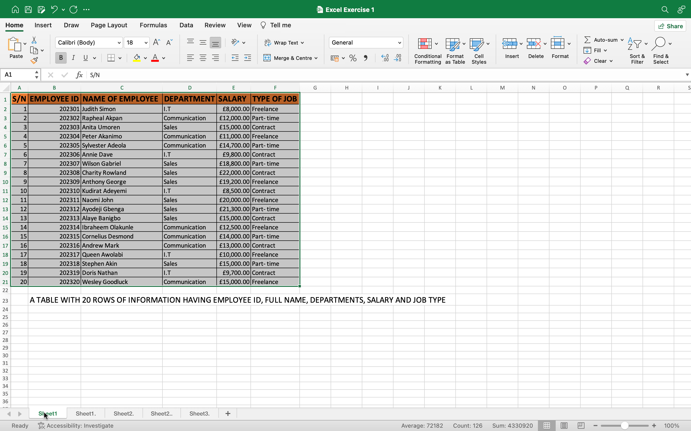
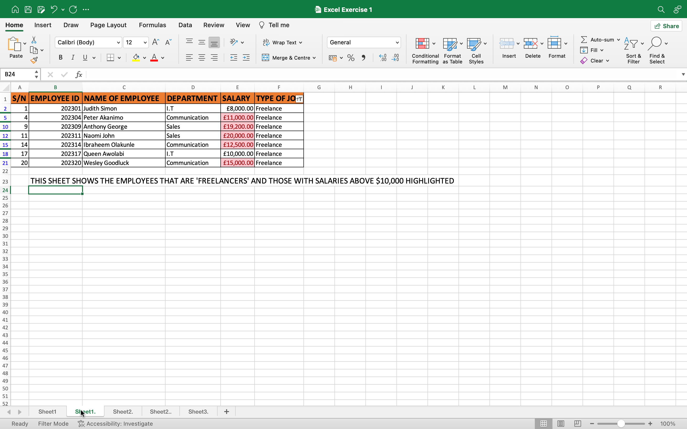
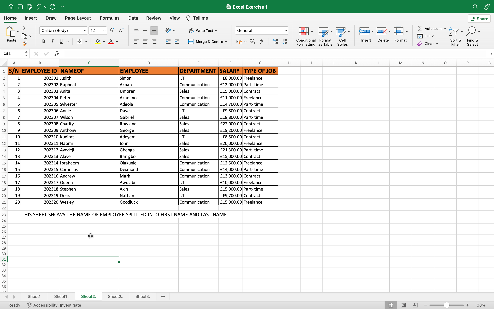
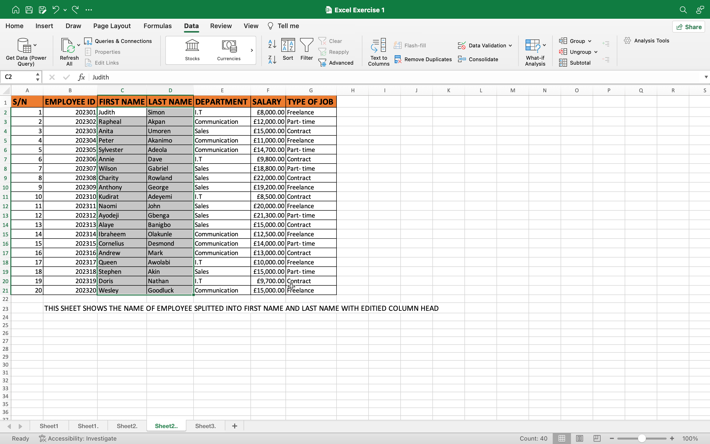
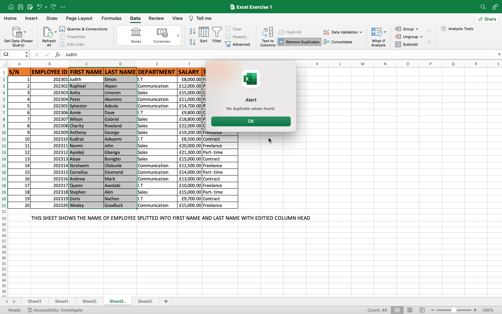
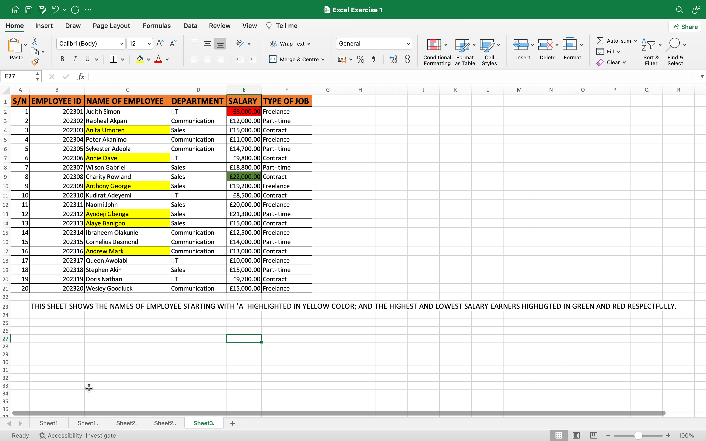

# **Data Analysis for heutech Venturez**
## **Introduction**

This analysis is based on my creative reasoning and manipulative skills in the the use of excel.
This analysis covers several areas required in data preparation; like the use of conditional formatting, filtering, removal of duplicate if any, splitting of columns, concatenating, sorting, creating of headers, flash filling, etc.
### **Task**
I created an imaginary table showing the fields below:
-	Employee ID
-	Employee Full name
-	Department (Communication, Sales and I.T)
-	Salary (between $5,000 to $25,000)
-	Job Type (Part Time, Freelance or Contract)
Furthermore, i made a Copy and paste this table into more sheets
Work sheet 1 shows only employees who are ‘Freelancers’ and Highlight the workers with salaries above $10,000.

In worksheet 2, i splitted the names of the employees to form two columns with first name and last name respectfully, After the split, i checked for duplicates if any exist and highlight.

In worksheet 3, I highlighted the employees whose names begin with the letter ‘E’ (using Yellow ) and lastly format the Salary Column to show the highest and lowest salaries highlighted with green and red backgrounds respectively.

#### **Table Showing 20 employees and their details in the company**
To achieve the table above, i used imaginary and familiar names, for the salaries i fixed amount that is between $5,000 and $25,000 as instructed, I added the Currency sign to the column,i also made the column head to be bold and catchy and made the background to have colours.

##### **Table showing employees that are Freelancers and those whose salaries are above $10,000**
To achieve this table, i used the filter option and Conditional formatting. where i selected the required fileds to fill.

###### **Table showing the names of employee splitted from one column to two**
To split the names of employees, i created a new column on the right side of the employee names to allow the splitted name fill it up. I proceeded further to use the Data section of the ribbon and selected text to column,  ticked the space option and perform the task. I searched for duplicates (no duplicates found)using the 'remove duplicate' function, i renamed the columns appropriately. The two tables below show the renamed column heads and the duplicate search.

###### **Table showing renamed columned Head**

###### **Table showing no duplicates in the columns with splitted names**

###### **Table showing names with first letter 'A'(I used 'E' as my names had no name starting with 'E')**

